# Tethermark

An open, headless AI security audit harness for repositories, local codebases, and hosted endpoints.

The harness combines deterministic evidence collection, LLM-guided planning and review, standards-based scoring, normalized persistence, and artifact export so runs are both queryable and debuggable.

## What It Does

- Audits `path`, `repo`, and `endpoint` targets from a single CLI or API surface.
- Uses a staged workflow: target prep, planning, threat modeling, eval/tool selection, lane analysis, supervisor review, selective corrections, scoring, remediation, and human review workflow.
- Supports synchronous runs plus queued async execution with polling, cancel/retry, and optional completion webhooks.
- Persists normalized run data for querying while still exporting raw artifacts for audit debugging.
- Supports OSS `local` persistence with SQLite-backed roots and metadata.
- Exposes stable query APIs and separate best-effort artifact/debug APIs.
- Includes a self-hostable OSS web UI for runs, jobs, reviews, artifacts, and persisted settings.

## Current Status

Tethermark is in public OSS release-candidate shape for local and trusted-team self-hosting.

- `local` is the OSS SQLite storage mode.
- Hosted production storage is not an OSS database mode; the hosted product provides its own Supabase/Postgres adapter around the shared persistence contracts.
- The default `.env.example` configuration uses the mock LLM runtime, so the repo can build and run without live model credentials.
- OSS auth defaults to `none`, which is appropriate for solo operators and trusted internal teams. In that mode, review roles and assignments are advisory governance rather than hard identity enforcement.
- The supported OSS path is end-to-end: preflight, run execution, findings, review workflow, runtime follow-up, exports, and guarded manual outbound GitHub actions.
- The main remaining non-goals for OSS are enterprise identity, hosted notification infrastructure, and non-SQLite persistence backends.

## Architecture

```mermaid
flowchart LR
    U["User / CI / Scheduler"] --> CLI["CLI (`apps/cli`)"]
    U --> API["HTTP API (`apps/api-server`)"]
    U --> MCP["MCP Bridge (`apps/mcp-server`)"]
    U --> WEB["Web UI (`apps/web-ui`)"]

    CLI --> ORCH["Core Orchestrator (`packages/core-engine`)"]
    API --> QUEUE["Async Run Queue"]
    API --> ORCH
    MCP --> ORCH
    WEB --> API

    QUEUE --> ORCH
    ORCH --> PREP["Prepare Target"]
    PREP --> PLAN["Planner Agent"]
    PLAN --> TM["Threat Model Agent"]
    TM --> EVAL["Eval Selection Agent"]
    EVAL --> LANES["Lane Plans + Standards Audit"]
    LANES --> TOOLS["Deterministic Tools / Evidence Providers"]
    TOOLS --> EVIDENCE["Normalized Evidence Records"]
    EVIDENCE --> SUP["Supervisor / Skeptic Agent"]
    SUP --> CORR["Selective Corrections / Reuse"]
    CORR --> SCORE["Scoring + Publishability"]
    SCORE --> REM["Remediation Agent"]
    REM --> REVIEW["Human Review Workflow"]
    REVIEW --> RFQ["Runtime Follow-up Queue"]
    RFQ --> RERUN["Linked Rerun Jobs"]
    RERUN --> EVIDENCE
    QUEUE --> WEBHOOK["Completion Webhook"]

    ORCH --> PERSIST["Normalized Persistence"]
    ORCH --> ART["Artifact Store"]
    PERSIST --> QUERY["Stable Query APIs"]
    ART --> DEBUG["Artifact / Debug APIs"]
    QUERY --> REVIEW
```



## Repo Layout

- `apps/cli`: command-line entrypoint for scans, reconstruction, and maintenance workflows
- `apps/api-server`: HTTP API for runs, targets, stats, observability, and artifact access
- `apps/mcp-server`: minimal MCP bridge for audit execution
- `apps/web-ui`: self-hostable OSS web interface for dashboard, runs, reviews, jobs, artifacts, and settings
- `packages/core-engine`: orchestration, stages, standards audit, persistence, sandboxing, and contracts
- `packages/agent-runtime`: agent execution wrapper
- `packages/llm-provider`: provider abstraction and mock/live model routing
- `packages/prompt-registry`: structured prompts and schemas for planner, eval selection, supervisor, and remediation
- `packages/trace-recorder`: invocation tracing
- `packages/handoff-contracts`: handoff record types
- `docs`: architecture notes and API boundary documentation

## Quick Start

### 1. Install

```bash
npm install
cp .env.example .env
```

### 2. Build and Test

```bash
npm run build
npm test
```

The repository CI runs the same core verification path on pushes and pull requests:

```bash
npm run build --silent
npm test --silent
npm run scan -- validate-fixtures
```

For a release-candidate verification pass, run:

```bash
npm run release:check
```

### 3. Run a Local Static Audit

```bash
npm run scan -- scan path . --mode static --package agentic-static
```

You can also scan a repo URL or endpoint:

```bash
npm run scan -- scan repo https://github.com/example/project --mode static --package deep-static
npm run scan -- scan endpoint https://example.com --mode runtime --package runtime-validated
```

### 4. Start the API

```bash
npm run api
```

### 5. Start the Web UI

```bash
npm run web
```

Or start both the API and web UI together:

```bash
npm run oss
```

The `oss` launcher builds once, then starts the API and web UI together from the compiled Node entrypoints. It is intended to work across Windows, macOS, and Linux, and the repository CI includes an `oss:check` smoke path for all three OS families.

By default the web UI serves on `http://127.0.0.1:8788` and proxies its backend calls to the API at `http://127.0.0.1:8787`.

Useful environment variables:

- `PORT`
- `WEB_UI_PORT`
- `WEB_UI_API_BASE_URL`
- `HARNESS_API_AUTH_MODE`
- `HARNESS_API_KEY`
- `HARNESS_DB_MODE`

The web UI is also deployable as a plain static app. It reads its backend origin from `apps/web-ui/static/config.js`, which defaults to `/api`. For Vercel or other static hosting, point `apiBaseUrl` at the hosted API origin or add a platform rewrite so `/api/*` reaches the API server.

Useful routes:

- `GET /health`
- `GET /auth/info`
- `POST /runs`
- `POST /runs/async`
- `GET /runs/async`
- `GET /runs/async/:jobId`
- `POST /runs/async/:jobId/cancel`
- `POST /runs/async/:jobId/retry`
- `GET /runs`
- `GET /runs/:runId/summary`
- `GET /runs/:runId/findings`
- `GET /runs/:runId/review-workflow`
- `GET /runs/:runId/review-actions`
- `POST /runs/:runId/review-actions`
- `GET /runs/:runId/outbound-preview`
- `GET /runs/:runId/outbound-approval`
- `POST /runs/:runId/outbound-approval`
- `GET /runs/:runId/outbound-send`
- `POST /runs/:runId/outbound-send`
- `GET /runs/:runId/outbound-verification`
- `POST /runs/:runId/outbound-verification`
- `GET /runs/:runId/outbound-delivery`
- `POST /runs/:runId/outbound-delivery`
- `GET /runs/:runId/observability-summary`
- `GET /runs/:runId/exports`
- `GET /targets`
- `GET /stats/runs`
- `GET /stats/observability`
- `GET /artifacts/runs/:runId`
- `GET /artifacts/runs/:runId/:artifactType`
- `GET /ui/settings`
- `PUT /ui/settings`
- `GET /ui/documents`
- `POST /ui/documents`
- `DELETE /ui/documents/:documentId`

### 6. Maintenance Workflows

```bash
npm run scan -- migrate local-db
npm run scan -- reconstruct runs
npm run scan -- validate-persistence
npm run scan -- migrate compact-bundle-exports
```

### 7. Human Review Workflows

```bash
npm run scan -- review queue
npm run scan -- review status <run-id>
npm run scan -- review action <run-id> --reviewer alice --action start_review
npm run scan -- review action <run-id> --reviewer alice --action approve_run --notes "validated"
```

Review workflow state is persisted per run and exposed over both CLI and API. Reviewer actions are append-only records rather than ad hoc artifact edits.

Async runs use the same orchestrator and persistence path as synchronous runs, but they are now tracked as durable async jobs with per-attempt run history. `POST /runs/async` returns a persisted job plus its attempts immediately, `GET /runs/async/:jobId` is the polling surface for that job, queued jobs survive API restarts, cancellation can be requested before start or during execution and is honored cooperatively at stage boundaries, canceled or failed jobs can be retried on the same job as a new attempt, and `completion_webhook_url` receives the terminal job plus its latest attempt context.

JSON-native exports expose a versioned Tethermark schema envelope and a per-run export catalog at `GET /runs/:runId/exports`. The current export contract and stable enum values are documented in `docs/export-schemas.md`.

Example consumers for executive summaries, run comparisons, runtime follow-up queues, and SARIF upload live under `examples/`.

Export maintenance is explicit too: run `npm run exports:check` to validate the current golden fixtures and `npm run exports:refresh` when intentionally updating the checked-in export snapshots.

## OSS Support Boundary

Tethermark OSS is intended for:

- solo developers
- trusted internal security engineers or small teams
- self-hosted API and web UI deployments
- manual or guarded outbound GitHub sharing

Tethermark OSS is not claiming:

- enterprise SSO or user lifecycle management
- internet-grade multi-user security when `auth=none`
- hosted notification routing or managed ops workflows
- non-SQLite production persistence backends

If you need enforced auth in OSS, use `HARNESS_API_AUTH_MODE=api_key` and put the service behind your own trusted network or reverse proxy controls.

## Release Checklist

The maintainer release checklist lives at [`docs/release-checklist.md`](docs/release-checklist.md). The short version is:

1. `npm run release:check`
2. `npm run api`
3. `npm run web`
4. complete one local scan plus one web-UI review/export smoke path
5. confirm the documented OSS limitations still match reality

## OSS Auth Model

The OSS stack supports practical self-hosting modes rather than full enterprise identity.

- `auth=none`: default local/trusted mode for solo users and trusted internal teams
- `auth=api_key`: simple enforced service/API authentication for self-hosted automation and internal deployments

When `auth=none` is active:

- the UI and API still track actors, workspace roles, assignments, and review actions
- those controls are useful for workflow discipline and audit history
- they are not a substitute for real user authentication or internet-exposed multi-user security

The web UI and API expose the active auth mode through `GET /auth/info` so operators can see whether review governance is advisory or enforced.

### 8. Bundled Validation Targets

The repo now includes small fixture targets under `fixtures/validation-targets/` for smoke testing and demos.

- `repo-posture-good`
- `agent-tool-boundary-risky`
- `noisy-fixtures`

Each fixture includes a `validation-expectations.json` file describing the expected target class, likely findings, and review posture.

`validate-fixtures` now uses an isolated temporary persistence root by default, so it can run safely alongside other local commands without contending on the shared local SQLite database. Pass `--persistence-root <dir>` only if you intentionally want fixture-validation runs persisted into a specific store.

## Audit Flow

The current runtime follows this high-level sequence:

1. Resolve configuration, policy pack, and audit package.
2. Prepare the target and build repo context.
3. Run planner, threat-model, and eval-selection agents.
4. Allocate audit lanes and execute deterministic evidence providers.
5. Normalize evidence into findings, control results, lane outputs, and scores.
6. Run the supervisor agent for QA and optionally trigger selective reruns.
7. Generate publishability decisions and remediation guidance.
8. Persist normalized records and export raw artifacts.
9. Accept reviewer actions and track explicit review state transitions when human review is required.

## Built-In Audit Packages

- `baseline-static`: cheapest recurring static audit
- `agentic-static`: static audit with explicit AI and agentic controls
- `deep-static`: deeper multi-lane static audit
- `runtime-validated`: bounded runtime validation path
- `premium-comprehensive`: most expansive package, with stricter review posture

## Persistence and Artifacts

The harness now has an explicit boundary between queryable state and archival debug payloads.

- Query APIs under `/runs`, `/targets`, and `/stats` are the stable integration surface.
- Artifact APIs under `/artifacts/runs/...` are best-effort archival/debug access.
- Reusable orchestration inputs such as planner output, threat model, eval selection, run plan, findings-pre-skeptic, score summary, and observations are persisted as normalized stage artifacts.
- Per-run bundle exports are optional debug exports rather than canonical persistence.

## Runtime Limitations

The OSS build has meaningful runtime validation support, but it still has practical limits:

- bounded host execution is opt-in via `HARNESS_ENABLE_HOST_SANDBOX_EXECUTION=1`
- local tool execution depends on installed binaries and host child-process permission
- Python worker-backed evidence depends on a working local Python runtime
- runtime probing is framework-aware for common Node and Python patterns, but not every stack is covered
- OSS database mode is limited to SQLite-backed `local`; hosted production storage belongs in the hosted Supabase/Postgres adapter.

## LLM Configuration

The default environment is mock-backed:

```bash
AUDIT_LLM_PROVIDER=mock
AUDIT_LLM_MODEL=mock-agent-runtime
```

Agent-specific overrides are supported for planner, threat model, eval selection, skeptic, and remediation agents.

## Web UI Settings

The OSS web UI persists operator settings and attached policy/reference documents through the same local SQLite persistence layer used by the engine.

Current settings sections:

- providers and model defaults
- credentials and endpoint references
- audit defaults
- preflight settings
- review settings
- integrations
- test-mode presets
- attached policy/reference/runbook documents

The integrations section now supports safe outbound preview settings for GitHub-style workflows. External posting remains disabled unless explicitly configured, and the current OSS surface prepares preview payloads through `/runs/:runId/outbound-preview`, records explicit per-run approval through `/runs/:runId/outbound-approval`, verifies repository write access through `/runs/:runId/outbound-verification`, stores a manual-send handoff through `/runs/:runId/outbound-send`, and records actual delivery attempts through `/runs/:runId/outbound-delivery`. GitHub execution requires an API token and base URL in persisted credentials, and it remains operator-triggered rather than automatic.

These records are available through the `/ui/settings` and `/ui/documents` API routes and are intended to back self-hosted operator preferences rather than browser-local-only state.

## Known Gaps

- Hosted Supabase/Postgres storage is implemented outside the OSS repo and should not be configured through OSS `HARNESS_DB_MODE`.
- The current implementation has eval selection, runtime validation candidates, and tool/evidence selection, but not a dedicated standalone `eval-runner` package.
- The OSS product has trusted-mode governance for review roles and assignments, but it does not yet include full built-in user login/session management for untrusted multi-user deployments.

## Docs

- [`CONTRIBUTING.md`](CONTRIBUTING.md)
- [`SECURITY.md`](SECURITY.md)
- [`.github/workflows/ci.yml`](.github/workflows/ci.yml)
- [`docs/HARNESS_ARCHITECTURE_NEXT.md`](docs/HARNESS_ARCHITECTURE_NEXT.md)
- [`docs/API_Stability_and_Artifact_Boundary.md`](docs/API_Stability_and_Artifact_Boundary.md)
- [`changelog.md`](changelog.md)
