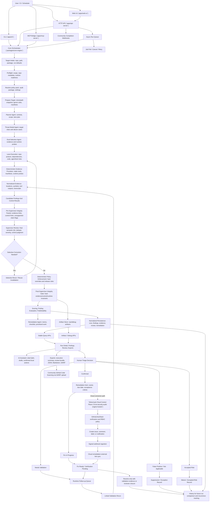

# Tethermark Community Edition

Tethermark Community Edition is the free, self-hosted edition of Tethermark: an open AI security audit harness for repositories and local AI/agent codebases.

The harness combines deterministic evidence collection, LLM-guided planning and review, standards-based scoring, normalized persistence, and artifact export so runs are both queryable and debuggable.

## What It Does

- Audits `path` and `repo` targets as the primary supported surfaces, with endpoint metadata reserved for reduced-confidence follow-up context.
- Uses a staged workflow: target prep, planning, threat modeling, eval/tool selection, lane analysis, pre-supervisor integrity packet, supervisor review, policy enforcement, post-supervisor integrity gate, scoring, remediation, and human review workflow.
- Treats runtime validation as isolated AI/agent behavior testing against established controls, not broad production endpoint pentesting.
- Supports synchronous runs plus queued async execution with polling, cancel/retry, and optional completion webhooks.
- Persists normalized run data for querying while still exporting raw artifacts for audit debugging.
- Supports Community Edition `local` persistence with SQLite-backed roots and metadata.
- Exposes stable query APIs and separate best-effort artifact/debug APIs.
- Includes a self-hostable Community Edition web UI for audits, findings, remediation, jobs, artifacts, and persisted settings.
- Adds a governed self-learning loop for review-derived improvement candidates, dry-run experiments, explicit promotion, versioned additive-only future-run consumption, and rollback history. Suppression/severity promotions remain non-executable without governed policy or disposition records. See [`docs/self-learning-governed-improvement-loop.md`](docs/self-learning-governed-improvement-loop.md).
- Includes a product benchmark suite for Tethermark release validation against pinned public AI-agent and LLM-app repositories. See [`docs/product-benchmark-suite.md`](docs/product-benchmark-suite.md).

## Current Status

Tethermark Community Edition is in production stabilization for local and trusted-team self-hosting. The current draft pull request is not a production release until its deterministic release checks and the remaining manual provider/runtime validations are complete.

- `local` is the Community Edition SQLite storage mode.
- Tethermark Cloud production storage is not a Community Edition database mode; the Cloud product provides its own Supabase/Postgres adapter around the shared persistence contracts.
- Community Edition defaults to local OpenAI Codex with ChatGPT sign-in for operator-started audits. The mock provider is selected explicitly by tests and CI only.
- Community Edition auth defaults to `none`, which is appropriate for solo operators and trusted internal teams. In that mode, review roles and assignments are advisory governance rather than hard identity enforcement.
- The supported Community Edition path is end-to-end for repository and local-path audits: preflight, run execution, findings, review workflow, runtime follow-up, exports, SARIF upload, and manual external remediation links.
- Runtime validation is a primary Community Edition capability for cloned or local targets through one user-facing **Local Runtime Sandbox**. Admin settings auto-resolve the strongest allowed local backend and gate runtime launch on readiness.
- The main remaining non-goals for Community Edition are enterprise identity, Cloud notification infrastructure, and non-SQLite persistence backends.

## Target Scope

Tethermark is AI-security focused. It is not a general-purpose production pentest platform.

Primary targets:

- open-source AI, agent, MCP, plugin, and tool-using repositories
- private repositories or local clones that the operator is authorized to audit
- local filesystem paths used for CI, internal review, or self-hosted assessment

Runtime validation should run against isolated copies of those targets. The preferred path is to clone or mirror the target, build it inside the Local Runtime Sandbox, inject fake secrets and simulated external services, execute AI-security eval packs, capture transcripts and tool-call evidence, and tear the environment down.

Tethermark owns sandbox orchestration, readiness, policy snapshots, evidence, observability, and remediation linkage. It does not build a custom low-level isolation runtime. The Community Edition resolver uses gVisor, rootless Podman, Podman, Docker, Docker Desktop, or future lightweight process wrapping when available and allowed by Admin policy. Tethermark Cloud third-party sandbox providers are metered Cloud features and live outside this repository. See [`docs/runtime-sandbox-architecture.md`](docs/runtime-sandbox-architecture.md).

Production endpoint testing is not a primary Community Edition claim. When an endpoint URL is supplied, it should be treated as scope/context or used only for explicitly allowed, non-destructive, reduced-confidence behavioral checks.

## Architecture


```mermaid
flowchart TD
    U["User / CI / Scheduler"] --> CLI["CLI (`apps/cli`)"]
    U --> WEB["Web UI (`apps/web-ui`)"]
    U --> API["HTTP API (`apps/api-server`)"]
    U --> MCP["MCP Bridge (`apps/mcp-server`)"]

    WEB --> API
    CLI --> ORCH["Core Orchestrator (`packages/core-engine`)"]
    API --> QUEUE["Async Run Queue"]
    API --> ORCH
    MCP --> ORCH
    QUEUE --> ORCH
    QUEUE --> JOBS["Job Poll / Cancel / Retry"]

    ORCH --> TARGET["Target Intake: repo, path, package, run defaults"]
    TARGET --> PREFLIGHT["Preflight: scope, repo metadata, runtime readiness"]
    PREFLIGHT --> CONFIG["Resolve policy pack, audit package, settings"]
    CONFIG --> PREP["Prepare Target: clone/path snapshot, ignore rules, manifests"]
    PREP --> PLAN["Planner Agent: controls, scope, lane plan"]
    PLAN --> THREAT["Threat Model Agent: target class and abuse cases"]
    THREAT --> EVAL["Eval Selection Agent: evidence and runtime probes"]
    EVAL --> LANES["Lane Execution: repo posture, dependencies, code, agent/tool risks"]
    LANES --> TOOLS["Deterministic Evidence Providers: static tools, manifests, runtime probes"]
    TOOLS --> EVIDENCE["Normalized Evidence: locations, symbols, tool outputs, transcripts"]
    EVIDENCE --> CANDIDATES["Candidate Findings And Control Results"]
    CANDIDATES --> PREQA["Pre-Supervisor Integrity Packet: evidence links, control hints, unsupported-claim flags"]
    PREQA --> SUP["Supervisor Review: final semantic QA, dedupe, severity, control judgment"]
    SUP --> CORR{"Selective Correction Needed?"}
    CORR -->|"Yes"| REWORK["Selective Rerun / Reuse Invalidation"]
    REWORK --> LANES
    CORR -->|"No"| POLICY["Deterministic Policy Enforcement: hard overrides and release rules"]
    POLICY --> POSTQA["Post-Supervisor Integrity Gate: hard evidence/control/runtime invariants"]
    POSTQA --> SCORE["Scoring, Finding Evaluation, Publishability"]
    SCORE --> REMMEMO["Remediation Agent: memo, checklist, prioritized work"]
    SCORE --> PERSIST["Normalized Persistence: runs, findings, evidence, review, remediation"]
    POSTQA --> ART["Artifact Store: raw/debug artifacts"]

    PERSIST --> APIQ["Stable Query APIs"]
    ART --> DEBUG["Artifact / Debug APIs"]
    APIQ --> UIREVIEW["Run Detail, Findings, Review, Exports"]
    DEBUG --> UIREVIEW
    UIREVIEW --> ASSIST["AI Assistant: cited Q&A, drafts, confirmed local actions"]

    UIREVIEW --> TRIAGE["Human Triage Decision"]
    TRIAGE --> CONFIRMED["Confirmed"]
    TRIAGE --> NEEDSVAL["Needs Validation"]
    TRIAGE --> FP["False Positive / Not Applicable"]
    TRIAGE --> RISK["Accepted Risk"]
    FP --> SUPPRESS["Suppression / Exception Record"]
    RISK --> WAIVER["Waiver / Accepted-Risk Record"]
    NEEDSVAL --> RFQ["Runtime Follow-up Queue"]
    CONFIRMED --> REMITEM["Remediation Item: owner, due date, acceptance criteria"]
    REMITEM --> FIXING["Fix In Progress"]
    FIXING --> READY["Fix Ready / Verification Pending"]
    READY --> RFQ
    RFQ --> RERUN["Linked Validation Rerun"]
    RERUN --> EVIDENCE
    READY --> RESOLVE["Resolve only with validation evidence or reviewer closure"]
    RESOLVE --> HISTORY["History for future run comparison and recurrence tracking"]
    SUPPRESS --> HISTORY
    WAIVER --> HISTORY
    PERSIST --> HISTORY

    UIREVIEW --> EXPORTS["Exports: executive summary, review bundle, JSON, Markdown, SARIF"]
    EXPORTS --> SARIF["Community GitHub Code Scanning via SARIF upload"]
    API --> GENERICWEBHOOK["Community Completion Webhooks"]

    REMITEM -.->|Cloud connector path| HOSTED["Tethermark Cloud Control Plane (`D:/ai-security-audit-engine-hosted`)"]
    HOSTED --> GHVERIFY["GitHub/Jira/Slack verification and RBAC policy"]
    GHVERIFY --> GHISSUE["Create issue, comment, label, or notification"]
    GHISSUE --> GHEVENT["Signed webhook ingestion"]
    GHEVENT --> SYNC["Cloud remediation external-link sync"]
    SYNC --> READY
```

## Repo Layout

- `apps/cli`: command-line entrypoint for scans, reconstruction, and maintenance workflows
- `apps/api-server`: HTTP API for runs, targets, stats, observability, and artifact access
- `apps/mcp-server`: minimal MCP bridge for audit execution
- `apps/web-ui`: self-hostable Community Edition web interface for dashboard, audits, findings, remediation, jobs, artifacts, and settings
- `packages/core-engine`: orchestration, stages, standards audit, persistence, sandboxing, and contracts
- `packages/validation-runner`: Local Runtime Sandbox provider contracts, backend resolution, launch gating, and runtime policy construction
- `packages/agent-runtime`: agent execution wrapper
- `packages/llm-provider`: provider abstraction and mock/live model routing
- `packages/prompt-registry`: structured prompts and schemas for planner, eval selection, supervisor, and remediation
- `packages/trace-recorder`: invocation tracing
- `packages/handoff-contracts`: handoff record types
- `docs`: architecture notes and API boundary documentation

## Quick Start

The supported baseline is Node.js 22.x or 24.x with npm 10.x or 11.x. Python-backed workers support Python 3.11–3.13. Exact operating-system, sandbox, and browser certification is maintained in [`docs/supported-platforms.md`](docs/supported-platforms.md); notably, real macOS Docker Desktop execution is not yet certified.

### 1. Install

```bash
npm run first-run -- --dry-run
npm run first-run
```

For a guided installation and readiness workflow, see [`docs/installation.md`](docs/installation.md).

The one-command first run enforces the supported Node major, installs the lockfile with `npm ci`, builds the application, creates/checks `.env`, runs `doctor`, and prints the next `setup-tools`, fixture-validation, and UI commands.

Runtime readiness is part of onboarding. Use:

```bash
npm run scan -- setup-runtime --dry-run
npm run scan -- runtime-doctor
npm run scan -- validate-runtime-fixtures
```

The web UI exposes Admin -> Runtime Sandbox for selected backend, candidate probes, warning/blocker status, network/resource defaults, and setup guidance.

Repository-local install, ref-pinned update/rollback, and guarded uninstall commands for Windows, macOS, and Linux are documented in [`docs/installation.md`](docs/installation.md). No hosted one-line installer is currently published.

### 2. Build and Test

```bash
npm run build
npm test
```

The repository CI runs the same core verification path on pushes and pull requests:

```bash
npm run build --silent
npm test --silent
npm run exports:check --silent
npm run scan -- validate-fixtures
```

The test runner forces `AUDIT_LLM_PROVIDER=mock`, removes live API keys from its process, and disables the learning scheduler. Running `npm test` never consumes ChatGPT-session or API-provider quota.

For a release-candidate verification pass, run:

```bash
npm run release:check
```

The release gate includes `npm run toolchain:check`, which verifies the checked-in Playwright package/browser revision, static scanner checksum, and runtime image digest contract. Browser binaries for UI testing are previewed and installed through `npm run setup:browser`; see [`docs/installation.md`](docs/installation.md).

Primary real-model release validation uses the local Codex CLI with ChatGPT subscription sign-in. It is separate from ordinary CI and requires an explicit quota acknowledgement:

```bash
npm run phase3:codex:live
```

API-key validation remains available only as an explicit secondary path through `npm run phase3:api:live`; it does not replace the Codex acceptance gate. Do not run either command as an ordinary test. See [`docs/live-model-validation.md`](docs/live-model-validation.md) for credential policy, exact opt-in, hard budgets, and redacted evidence handling.

Runtime-specific release gates:

```bash
npm run production:runtime-readiness
npm run production:harness-readiness
```

`production:runtime-readiness` requires both a launchable Local Runtime Sandbox backend and successful execution of an isolated runtime fixture. The Docker fixture uses a digest-pinned image, default-deny networking, a read-only source mount, bounded writable scratch, non-root execution, dropped capabilities, resource limits, and verified cleanup. Evidence is written under `.artifacts/runtime-readiness/`. Static audits remain available when runtime readiness is blocked. Runtime audits now stage the source through a read-only mount into a disposable workspace volume and execute exact command arrays in the selected container backend without host fallback.

Operator-started runtime validation defaults its model-backed planning, supervision, and remediation to local Codex with ChatGPT sign-in. The Codex subprocess runs inference-only from an empty ephemeral directory with command and interactive tool features disabled and a credential-scrubbed environment; its `read-only` flag is defense in depth, not the runtime-isolation boundary. Target commands execute only in the selected container sandbox. API-key routing is an explicit, separately confirmed secondary override.

### 3. Run a Local Static Audit

```bash
npm run scan -- scan path . --mode static --package agentic-static
```

You can also scan a repo URL:

```bash
npm run scan -- scan repo https://github.com/example/project --mode static --package deep-static
```

Repository URL requirements:

- Git must be installed and available on `PATH`.
- Tethermark uses the operator's local Git access. Public and private repos must work non-interactively with `git ls-remote` and `git clone` from the same machine.
- HTTPS URLs require normal Git credentials when the repo is private, usually Git Credential Manager, a PAT-backed credential helper, and any required SSO authorization.
- SSH URLs are supported in both `git@host:org/repo.git` and `ssh://git@host/org/repo.git` forms when the local SSH key, agent, and host trust are already configured.
- Tethermark disables interactive Git prompts during preflight so missing credentials fail before a queued job starts.
- On Windows, if Git's bundled CA store rejects a valid HTTPS certificate chain, Tethermark retries the Git command with the Windows certificate store for that command only. It does not change global Git config or disable TLS verification.

Quick access checks:

```bash
git ls-remote https://github.com/example/project.git HEAD
git ls-remote git@github.com:example/project.git HEAD
```

If either command fails locally, fix Git/network credentials first or audit a local clone with `scan path`.

### 4. Start the API

```bash
npm run api
```

### 5. Start the Web UI

```bash
npm run web
```

Or start both the API and web UI together:

```bash
npm run oss
```

The `oss` launcher builds once, then starts the API and web UI together from the compiled Node entrypoints. It is intended to work across Windows, macOS, and Linux, and the repository CI includes an `oss:check` smoke path for all three OS families.

By default the web UI serves on `http://127.0.0.1:8788` and proxies its backend calls to the API at `http://127.0.0.1:8787`. Both services bind only to loopback; changing a port does not change that boundary.

Useful environment variables:

- `PORT`
- `HARNESS_API_HOST`
- `WEB_UI_PORT`
- `WEB_UI_HOST`
- `WEB_UI_API_BASE_URL`
- `HARNESS_API_AUTH_MODE`
- `HARNESS_API_KEY`
- `HARNESS_EXTERNAL_BIND_ACKNOWLEDGEMENT`
- `HARNESS_DB_MODE`
- `HARNESS_ENV_FILE`
- `HARNESS_ARTIFACT_ROOT`
- `HARNESS_LOCAL_DB_ROOT`

Binding either service to a non-loopback address exposes audit operations because the web UI proxies `/api` requests. Tethermark therefore refuses to start unless all of these conditions are met:

1. `HARNESS_API_AUTH_MODE=api_key`
2. `HARNESS_API_KEY` contains at least 32 characters
3. `HARNESS_EXTERNAL_BIND_ACKNOWLEDGEMENT=I_UNDERSTAND_TETHERMARK_WILL_BE_NETWORK_ACCESSIBLE`

An allowed external start prints a security warning. Community Edition does not terminate TLS, so external binding must remain behind a trusted TLS reverse proxy and firewall; it is not a safe direct Internet deployment. The API, web UI, and combined `npm run oss` launcher all enforce the same policy before listening.

The web UI is also deployable as a plain static app. It reads its backend origin from `apps/web-ui/static/config.js`, which defaults to `/api`. For Vercel or other static hosting, point `apiBaseUrl` at the hosted API origin or add a platform rewrite so `/api/*` reaches the API server.

Useful routes:

- `GET /health`
- `GET /auth/info`
- `POST /runs`
- `POST /runs/async`
- `GET /runs/async`
- `GET /runs/async/:jobId`
- `POST /runs/async/:jobId/cancel`
- `POST /runs/async/:jobId/retry`
- `GET /runs`
- `GET /runs/:runId/summary`
- `GET /runs/:runId/findings`
- `GET /runs/:runId/review-workflow`
- `GET /runs/:runId/review-actions`
- `POST /runs/:runId/review-actions`
- `GET /runs/:runId/outbound-preview`
- `GET /runs/:runId/outbound-approval`
- `POST /runs/:runId/outbound-approval`
- `GET /runs/:runId/outbound-send`
- `POST /runs/:runId/outbound-send`
- `GET /runs/:runId/outbound-verification`
- `POST /runs/:runId/outbound-verification`
- `GET /runs/:runId/outbound-delivery`
- `POST /runs/:runId/outbound-delivery`
- `GET /runs/:runId/observability-summary`
- `GET /runs/:runId/exports`
- `GET /targets`
- `GET /stats/runs`
- `GET /stats/observability`
- `GET /artifacts/runs/:runId`
- `GET /artifacts/runs/:runId/:artifactType`
- `GET /ui/settings`
- `PUT /ui/settings`
- `GET /ui/documents`
- `POST /ui/documents`
- `DELETE /ui/documents/:documentId`

### 6. Maintenance Workflows

```bash
npm run scan -- migrate local-db
npm run scan -- reconstruct runs
npm run scan -- validate-persistence
npm run scan -- migrate compact-bundle-exports
npm run scan -- artifacts prune --older-than 30d --dry-run
npm run scan -- artifacts prune --older-than 30d
```

### 7. Human Review Workflows

```bash
npm run scan -- review queue
npm run scan -- review status <run-id>
npm run scan -- review action <run-id> --reviewer alice --action start_review
npm run scan -- review action <run-id> --reviewer alice --action approve_run --notes "validated"
```

Review workflow state is persisted per run and exposed over both CLI and API. Reviewer actions are append-only records rather than ad hoc artifact edits.

Async runs use the same orchestrator and persistence path as synchronous runs, but they are now tracked as durable async jobs with per-attempt run history. `POST /runs/async` returns a persisted job plus its attempts immediately, `GET /runs/async/:jobId` is the polling surface for that job, queued jobs survive API restarts, cancellation can be requested before start or during execution and is honored cooperatively at stage boundaries, canceled or failed jobs can be retried on the same job as a new attempt, and `completion_webhook_url` receives the terminal job plus its latest attempt context.

JSON-native exports expose a versioned Tethermark schema envelope and a per-run export catalog at `GET /runs/:runId/exports`. The current export contract and stable enum values are documented in `docs/export-schemas.md`.

Example consumers for executive summaries, run comparisons, runtime follow-up queues, and SARIF upload live under `examples/`.

Export maintenance is explicit too: run `npm run exports:check` to validate the current golden fixtures and `npm run exports:refresh` when intentionally updating the checked-in export snapshots.

Product benchmark validation is separate from user target history. List or dry-run the default public benchmark cases with:

```bash
npm run benchmark:product
```

Execute the default pinned public benchmark suite with:

```bash
npm run benchmark:product:execute
```

See [`docs/product-benchmark-suite.md`](docs/product-benchmark-suite.md) for suite design, pass/fail semantics, and baseline comparison.

## Community Edition Support Boundary

The canonical CE/hosted capability and repository split is documented in [`docs/community-edition-hosted-boundary.md`](docs/community-edition-hosted-boundary.md). The governed audit, review, policy, and learning core remains shared and available in CE. A hosted service may add multi-tenant identity and policy, distributed scheduling, fleet analytics, managed connectors, and service operations outside this repository, but cannot weaken the shared evidence or approval rules.

Tethermark Community Edition is intended for:

- solo developers
- trusted internal security engineers or small teams
- self-hosted API and web UI deployments
- manual or guarded outbound GitHub sharing

Tethermark Community Edition is not claiming:

- enterprise SSO or user lifecycle management
- internet-grade multi-user security when `auth=none`
- Cloud notification routing or managed ops workflows
- non-SQLite production persistence backends

If you need enforced auth in Community Edition, use `HARNESS_API_AUTH_MODE=api_key`. External binding additionally requires the explicit acknowledgement described above and a trusted TLS reverse proxy and firewall.

The credential, webhook, archive, repository, artifact, and runtime-mount trust boundaries are documented in [`docs/security-threat-model.md`](docs/security-threat-model.md).

Dedicated-account systemd, launchd, and Windows Task Scheduler examples, protected filesystem layouts, and the shared trusted-team boundary are documented in [`docs/shared-service-deployment.md`](docs/shared-service-deployment.md).

The complete local data map, backup/restore and retention contract, redacted diagnostics command, privacy boundary, and credential-removal procedure are documented in [`docs/data-lifecycle-and-privacy.md`](docs/data-lifecycle-and-privacy.md).

Executable clean-install, two-ref update, state-preservation, and post-update launch evidence across Windows, Ubuntu, and macOS is defined in [`docs/install-upgrade-verification.md`](docs/install-upgrade-verification.md).

Release dependency, license, secret, Semgrep, Trivy, and OpenSSF Scorecard thresholds and exception handling are documented in [`docs/release-security-gate.md`](docs/release-security-gate.md).

Reproducible source archives, the combined npm/Python CycloneDX SBOM, SHA-256 manifests, GitHub/Sigstore attestations, and consumer verification commands are documented in [`docs/release-artifact-verification.md`](docs/release-artifact-verification.md).

## Release Checklist

The maintainer release checklist lives at [`docs/release-checklist.md`](docs/release-checklist.md). The short version is:

1. `npm run release:check`
2. complete the primary bounded Codex/ChatGPT-session gates described in [`docs/live-model-validation.md`](docs/live-model-validation.md)
3. `npm run api`
4. `npm run web`
5. complete one local scan plus one web-UI review/export smoke path
6. confirm the documented Community Edition limitations still match reality

## Community Edition Auth Model

Community Edition supports practical self-hosting modes rather than full enterprise identity.

- `auth=none`: default local/trusted mode for solo users and trusted internal teams
- `auth=api_key`: simple enforced service/API authentication for self-hosted automation and internal deployments

When `auth=none` is active:

- the UI and API still track actors, workspace roles, assignments, and review actions
- those controls are useful for workflow discipline and audit history
- they are not a substitute for real user authentication or internet-exposed multi-user security

The web UI and API expose the active auth mode through `GET /auth/info` so operators can see whether review governance is advisory or enforced.

### 8. Bundled Validation Targets

The repo now includes small fixture targets under `fixtures/validation-targets/` for smoke testing and demos.

- `repo-posture-good`
- `agent-tool-boundary-risky`
- `noisy-fixtures`

Each fixture includes a `validation-expectations.json` file describing the expected target class, likely findings, and review posture.

`validate-fixtures` now uses an isolated temporary persistence root by default, so it can run safely alongside other local commands without contending on the shared local SQLite database. Pass `--persistence-root <dir>` only if you intentionally want fixture-validation runs persisted into a specific store.

## Audit Flow

The current runtime follows this high-level sequence:

1. Resolve configuration, policy pack, and audit package.
2. Prepare the target and build repo context.
3. Run planner, threat-model, and eval-selection agents.
4. Allocate audit lanes and execute deterministic evidence providers.
5. Normalize evidence into findings, control results, lane outputs, and scores.
6. Build the pre-supervisor integrity packet with deterministic evidence-link checks, control-mapping hints, and unsupported-claim flags.
7. Run the supervisor agent as the final semantic QA reviewer; it can approve findings, drop/downgrade findings, or trigger selective reruns.
8. Enforce deterministic policy rules and run the post-supervisor integrity gate for hard invariants such as missing evidence, unknown controls, and static/runtime overclaims.
9. Generate publishability decisions and remediation guidance.
10. Persist normalized records and export raw artifacts.
11. Accept reviewer actions and track explicit review state transitions when human review is required.

### Publisher Module

Community Edition keeps public publishing controls disabled by default. Normal users see finding triage, reports, and local exports, but not publication-safety overrides intended for downstream editorial workflows.

The optional publisher module is reserved for AI Security Base-style operation, where audit results are reviewed for public website/newsletter use. To enable those UI controls in a private deployment, set `window.HARNESS_WEB_UI_CONFIG.publisher.enabled` to `true` in `apps/web-ui/static/config.js`.

## Built-In Audit Packages

- `baseline-static`: cheapest recurring static audit
- `agentic-static`: static audit with explicit AI and agentic controls
- `deep-static`: deeper multi-lane static audit
- `runtime-validated`: bounded AI/agent runtime validation for isolated repo or local-path targets
- `comprehensive-local`: most expansive local package, with stricter review posture

## System Policies

Community Edition initializes four versioned safe policies and manages them under **System -> Policies**. Policy versions are checksummed and immutable after publication; default, project, target, and audit-package bindings resolve before an async audit is queued. Every successful run persists and exports its exact `resolved-system-policy` snapshot.

When `HARNESS_API_AUTH_MODE=api_key`, system-policy administration requires `HARNESS_API_KEY`. With authentication disabled, the UI displays a trusted-local-deployment warning. The admin API is rooted at `/system/policies`; catalog metadata is available from `/system/controls` and `/system/audit-packages`.

## Persistence and Artifacts

The harness now has an explicit boundary between queryable state and archival debug payloads.

- Query APIs under `/runs`, `/targets`, and `/stats` are the stable integration surface.
- Artifact APIs under `/artifacts/runs/...` are best-effort archival/debug access.
- Reusable orchestration inputs such as planner output, threat model, eval selection, run plan, findings-pre-skeptic, score summary, and observations are persisted as normalized stage artifacts.
- Per-run bundle exports are optional debug exports rather than canonical persistence.
- The API process schedules local retention maintenance every 24 hours: run artifacts older than 30 days and sandbox/source copies older than 7 days are removed by default. Queued, starting, and running audit IDs are protected. Normalized audit history remains in SQLite, while stale raw-artifact index rows are reconciled so artifact APIs do not advertise deleted files.
- Manual preview/pruning remains available through the existing UI and `npm run scan -- artifacts prune`. The CLI supports `--kind runs|sandboxes|all`, `--older-than <days|30d>`, `--max-gb <n>`, and `--dry-run`. Configure scheduling with `HARNESS_ARTIFACT_RETENTION_DAYS`, `HARNESS_SANDBOX_RETENTION_DAYS`, `HARNESS_ARTIFACT_RETENTION_MAX_GB`, and `HARNESS_ARTIFACT_RETENTION_INTERVAL_MS`; set `HARNESS_DISABLE_ARTIFACT_RETENTION_SCHEDULER=1` only when external maintenance owns retention.
- The latest maintenance state and the newest 100 success/failure records are stored under `.artifacts/maintenance`. Retention never deletes normalized run, finding, evidence, review, or learning rows.

## Runtime Limitations

Community Edition has meaningful runtime validation support, but it is intentionally constrained:

- runtime launch is gated by Local Runtime Sandbox readiness
- internal backend choice is automatic and admin-configurable; normal launch flows show only Local Runtime Sandbox
- Docker Desktop on Windows/macOS is a warning backend with weaker isolation claims than Linux gVisor/rootless Podman
- local tool execution depends on installed binaries and host child-process permission
- Python worker-backed evidence depends on a working local Python runtime
- runtime probing is framework-aware for common Node and Python patterns, but not every stack is covered
- runtime checks should use isolated cloned/local targets, fake credentials, and simulated service/tool backends where possible
- production endpoint testing is out of scope except for explicitly authorized, non-destructive, reduced-confidence probes
- runtime evidence should map back to AI-security controls such as OWASP LLM, MITRE ATLAS, NIST AI RMF, and Tethermark eval-pack controls
- Community Edition database mode is limited to SQLite-backed `local`; Cloud production storage belongs in the Tethermark Cloud Supabase/Postgres adapter.

## LLM Configuration

The Community Edition default for an explicit operator-started local audit is OpenAI Codex with the operator's local ChatGPT sign-in:

```bash
AUDIT_LLM_PROVIDER=openai_codex
AUDIT_LLM_MODEL=gpt-5.6-sol
```

Mock mode is an explicit deterministic-development and CI configuration. It does not validate real model behavior:

```bash
AUDIT_LLM_PROVIDER=mock
AUDIT_LLM_MODEL=mock-agent-runtime
```

Live API-key mode is available with:

```bash
AUDIT_LLM_PROVIDER=openai
AUDIT_LLM_MODEL=gpt-5.4-mini
AUDIT_LLM_API_KEY=sk-...
```

Local Codex ChatGPT-sign-in mode is available for operator-owned runs after the Codex CLI is installed and signed in:

```bash
AUDIT_LLM_PROVIDER=openai_codex
AUDIT_LLM_MODEL=gpt-5.6-sol
AUDIT_LLM_CODEX_COMMAND=codex
AUDIT_LLM_CODEX_SANDBOX=read-only
```

Codex ChatGPT-session mode delegates structured agent steps through `codex exec` and uses the operator's local Codex entitlement subject to provider plan limits. Tethermark does not store ChatGPT access tokens in this mode. It is limited to explicit local operator launches; unattended and service workloads require an API-key provider. See [`docs/LLM_PROVIDER_AND_AGENT_BACKEND_MODES.md`](docs/LLM_PROVIDER_AND_AGENT_BACKEND_MODES.md) for the provider/backend boundary and [`docs/provider-workload-policy.md`](docs/provider-workload-policy.md) for the enforced workload matrix.

In Settings -> Agent Configuration, Tethermark reports cached ChatGPT authentication separately from Codex CLI execution readiness. A cached session alone is not enough: the configured CLI must also complete a bounded `codex login status` check before the UI reports that local audits are ready. Use the advanced Codex CLI command field when the runnable executable is not available as `codex` on the API server's PATH.

Agent-specific overrides are supported for planner, threat model, eval selection, skeptic, and remediation agents.

## Web UI Settings

The Community Edition web UI persists operator settings and attached policy/reference documents through the same local SQLite persistence layer used by the engine.

Current settings sections:

- providers and model defaults
- credentials and endpoint references
- audit defaults
- governance, with tabs for gates, policy packs, and reference documents
- integrations
- test-mode presets

The Community Edition audit engine treats governance settings as local execution policy. The `Gates` tab decides when an audit launch, finding, disposition, or output requires human control. The `Policy Packs` tab manages the portable rule/control contract used by audit runs. The `Reference Documents` tab attaches contextual policy, standard, runbook, and exception material for audits and reviewers. In integrated deployments, an external assurance control plane can become the authoritative system for policy lifecycle, evidence retention, accepted risk, recertification, and audit packets while Community Edition continues to persist the resolved policy and document snapshots used by each run.

The integrations section now supports safe outbound preview settings for GitHub-style workflows. Community Edition prepares preview payloads through `/runs/:runId/outbound-preview`, records explicit per-run approval through `/runs/:runId/outbound-approval`, and stores a manual-send handoff through `/runs/:runId/outbound-send`. Token-backed repository verification and external GitHub/Jira/Slack/email delivery are Tethermark Cloud features; Community Edition `/runs/:runId/outbound-verification` and `/runs/:runId/outbound-delivery` return guidance instead of sending data externally.

These records are available through the `/ui/settings` and `/ui/documents` API routes and are intended to back self-hosted operator preferences rather than browser-local-only state.

## Known Gaps

- Tethermark Cloud Supabase/Postgres storage is implemented outside this repository and should not be configured through Community Edition `HARNESS_DB_MODE`.
- The current implementation has eval selection, runtime validation candidates, and tool/evidence selection, but not a dedicated standalone `eval-runner` package.
- Community Edition has trusted-mode governance for review roles and assignments, but it does not yet include full built-in user login/session management for untrusted multi-user deployments.

## Docs

- [`CONTRIBUTING.md`](CONTRIBUTING.md)
- [`SECURITY.md`](SECURITY.md)
- [`.github/workflows/ci.yml`](.github/workflows/ci.yml)
- [`docs/HARNESS_ARCHITECTURE_NEXT.md`](docs/HARNESS_ARCHITECTURE_NEXT.md)
- [`docs/API_Stability_and_Artifact_Boundary.md`](docs/API_Stability_and_Artifact_Boundary.md)
- [`changelog.md`](changelog.md)
