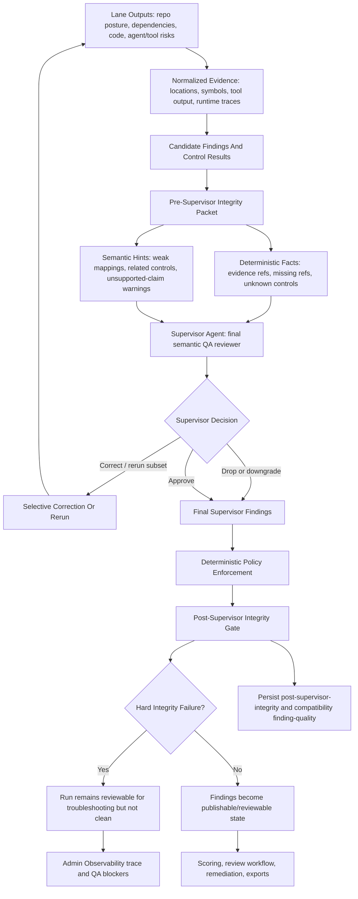

# Finding Integrity And Supervisor QA Workflow

Tethermark separates deterministic integrity checks from supervisor judgment. This prevents deterministic helper logic from becoming a hidden second reviewer, while still treating LLM output as untrusted before it affects downstream state.

## Purpose

The deterministic integrity checks exist to catch common mechanical and policy failures before a run is treated as reviewable:

- findings without persisted evidence
- finding evidence references that do not resolve to normalized evidence records
- findings with no mapped controls
- findings mapped to controls that do not exist or appear weakly related
- static-only findings that overclaim runtime proof, exploitability, or external impact
- secret-exposure claims without matching secret, credential, token, scanner, or source evidence

The supervisor agent remains the final semantic QA reviewer. It decides whether a finding is appropriate, whether the severity is justified, and whether the corresponding control mapping is correct.

## Workflow Position

The workflow is:

1. **Pre-supervisor evidence packet**
   - Standards/control assessment emits candidate findings as `findings-pre-skeptic`.
   - Tethermark builds `finding-integrity-pre-supervisor`.
   - This packet contains deterministic facts and heuristic hints: resolved evidence, missing evidence refs, unsupported claim flags, weak control mappings, and recommended controls.
   - The supervisor agent receives this as input, but remains responsible for semantic judgment.

2. **Supervisor review**
   - The supervisor may uphold findings, request selective correction, rerun upstream stages, drop unsupported findings, or downgrade controls.
   - If correction is requested, corrected results go back through supervisor review.

3. **Policy enforcement**
   - Hard policy rules are enforced deterministically after supervisor review.
   - Policy is also provided to the supervisor as context, but enforcement does not rely on LLM compliance.

4. **Post-supervisor integrity gate**
   - Policy overrides are applied.
   - Tethermark runs a final deterministic integrity gate on final findings and final control results.
   - This output is persisted as `post-supervisor-integrity`.
   - The existing `finding-quality` API remains as a compatibility alias for the post-supervisor integrity payload.

The post-supervisor integrity gate is not another semantic reviewer. It checks hard invariants such as evidence references, control ID existence, required fields, and static-only/runtime overclaims.

Authority model:

- The pre-supervisor packet is an input to supervisor review, not a final verdict.
- The supervisor is the final semantic reviewer for finding relevance, severity, false-positive risk, and control-fit judgment.
- Deterministic policy enforcement applies non-negotiable product and safety rules after supervisor review.
- The post-supervisor integrity gate validates hard invariants; it must not reverse supervisor's semantic judgment based only on heuristic weak-mapping signals.

## Validator Components

### Evidence Link Validation

The validator matches each finding's evidence references against normalized evidence records by evidence ID, source ID, artifact path, summary, location path, URI, symbol, or label. Missing references are recorded in `missing_evidence_refs`.

### Evidence Support Verdict

Each finding receives one of:

- `supported`: cited evidence references resolve cleanly
- `partially_supported`: related evidence exists, but references are indirect or incomplete
- `unsupported`: no persisted evidence references or related normalized evidence records exist

### Claim-To-Evidence Consistency

The validator flags specific high-risk unsupported claims:

- runtime or execution behavior claimed from static-only evidence
- exploitability, RCE, privilege escalation, or data exfiltration claimed without direct exploit, runtime, trace, or reproduction evidence
- secret exposure claimed without matching secret-scanning or source evidence

This is rule-based claim checking. It is not a full natural-language proof of every sentence in a finding.

### Control Mapping Validation And Hints

Each mapped control is checked against:

- the control catalog
- normalized control results
- control result backlinks to the finding
- evidence control IDs
- topic and token overlap between the finding, evidence, and control text

Before supervisor review, each finding receives one of:

- `correct`
- `plausible`
- `weak`
- `wrong_control`
- `missing_control`

Before supervisor review, weak or wrong-looking mappings are semantic hints. The supervisor decides whether they are actually wrong. After supervisor review, the deterministic gate only blocks hard integrity failures such as missing controls or unknown control IDs; weaker semantic mapping signals remain review context rather than an automatic final veto.

### Expected-Control Coverage

Expected-control coverage is enforced in two places:

- planner and eval-selection stages select applicable controls and provider mappings for the audit scope
- fixture validation checks expected finding categories and expected likely controls for known benchmark targets

The finding QA validator checks each emitted finding's own control mapping. It does not by itself prove that every possible missing control was discovered.

### Duplicate And Conflict Detection

Duplicate and conflict detection currently lives in finding evaluation rather than the finding QA validator. It groups findings by similar title/category, overlapping controls, or shared evidence symbols, and flags conflicts when linked findings have materially different severity or publication posture.

### Supervisor / LLM Judge

The supervisor agent is the LLM-backed secondary reviewer. It receives deterministic finding QA facts and must judge evidence sufficiency, false-positive risk, claim support, and control mapping quality. It can emit typed actions to rerun planner, threat model, eval selection, evidence subsets, lanes, tools, or control subsets, or to drop/downgrade unsupported outputs.

There is not a separate third LLM judge after the supervisor. The final deterministic step is a post-supervisor integrity gate, not a semantic QA agent.

### Golden Benchmark Regression

Golden benchmark regression means running known targets with expected outcomes and failing the test if the audit drifts unexpectedly. Tethermark currently has:

- fixture validation for expected target class, expected finding categories, expected likely controls, and human-review requirement
- golden export snapshots for executive JSON, executive Markdown, and SARIF output

This protects against regressions where a code change silently stops detecting an expected class of finding or stops assessing an expected control. It does not prove that all findings in a new real repository are correct.

## Observability

Admin Observability exposes structured trace data for troubleshooting:

- stage timeline
- agent invocations
- handoffs
- intermediate artifacts
- tool executions
- supervisor review
- correction plan and result
- `finding-integrity-pre-supervisor`
- policy application
- `post-supervisor-integrity` / compatibility `finding-quality`
- QA blockers

Tethermark intentionally does not store hidden model chain-of-thought. It stores structured inputs, outputs, rationale summaries, QA verdicts, and evidence artifacts that are safe to inspect and use for debugging.

## Interpreting Results

Use the workflow as an automated audit-quality guardrail:

- `pass`: final findings satisfy deterministic integrity checks
- `needs_review`: evidence or mappings are plausible but incomplete and should remain visible to human review
- `fail`: at least one final finding is unsupported, missing controls, uses unknown controls, or contains unsupported high-risk claims

A failed post-supervisor integrity verdict means the run is still useful for troubleshooting, but it should not be treated as a clean audit result until the finding is corrected, downgraded, dropped, or manually reviewed.
