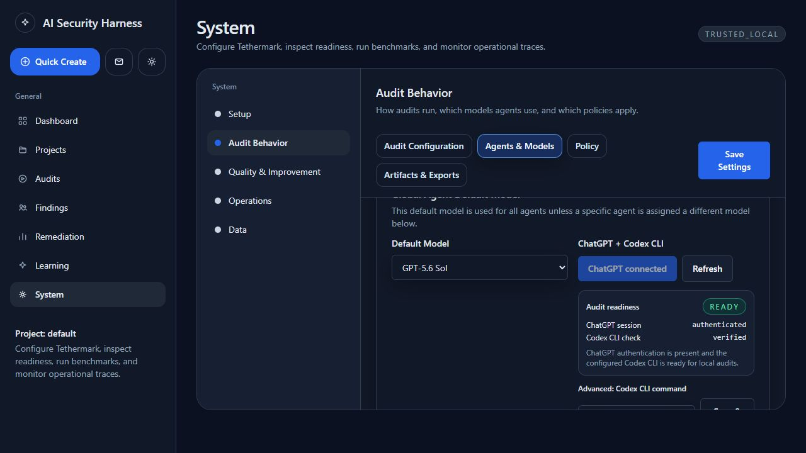
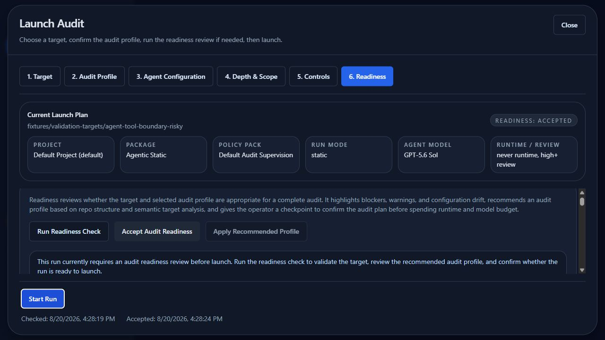
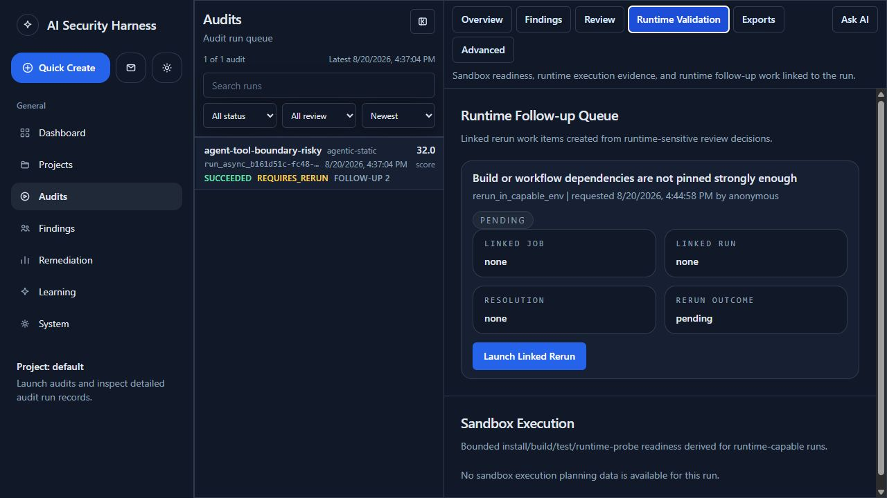

# Community Edition Operator Workflow

This guide covers the complete local audit lifecycle for a first-time Community Edition operator.

## 1. Start And Verify Tethermark

From the repository root:

```bash
npm install
npm run scan -- onboard
npm run scan -- doctor
npm run oss
```

Open `http://127.0.0.1:8788`. A clean installation should show an empty Dashboard rather than an error. If the UI cannot reach the API, confirm `http://127.0.0.1:8787/health` returns `status: ok`, then restart `npm run oss` and use the UI retry action.

## 2. Connect ChatGPT Through Codex

Open **System -> Audit Behavior -> Agents & Models**. The recommended Community Edition default is **ChatGPT + Codex CLI** (`openai_codex`), which uses the signed-in ChatGPT subscription rather than an OpenAI API key.

- If the page says **ChatGPT connected**, use **Refresh** to verify the session and CLI again.
- If it is disconnected, use the connection action and complete the Codex/ChatGPT sign-in in the launched flow. Return to Tethermark and refresh status.
- Do not paste an OpenAI API key for this provider. API-key mode is a separate optional provider.

Ready means the page shows the ChatGPT session as authenticated and the Codex CLI check as verified. Authentication secrets and raw CLI output are not displayed.



## 3. Launch With Readiness Review

Choose **Quick Create**, then:

1. Select a project or choose **Custom run**.
2. Confirm the local path or repository URL.
3. Choose an audit package. **Agentic Static** is the standard static package for AI-agent repositories.
4. Confirm the inherited ChatGPT/Codex model.
5. Open **Readiness** and run the readiness check.
6. Review blockers, warnings, target classification, external-tool coverage, and configuration drift.
7. Apply the recommended profile if appropriate, rerun readiness, and accept the result.
8. Choose **Start Run** once. The button changes to **Launching Audit...** and stays disabled while the request is active.

The launch is queued as a durable background job. Tethermark opens the run when its run identifier is available; otherwise it opens **System -> Jobs** so the operator can follow progress, retry a failed job, or cancel queued work without submitting the audit twice.



Missing, skipped, blocked, or failed tools are limitations—not clean passes. They remain visible in run details and exports.

## 4. Review Findings

Open **Audits**, select the completed run, and inspect **Overview**, **Findings**, **Evidence**, and **Review**.

For each material finding:

1. Confirm the evidence path and mapped controls.
2. Assign a reviewer and start review.
3. Choose confirmed, false positive, out of scope, accepted risk, or needs validation.
4. Record notes and any severity change.
5. Request a capable-environment rerun or manual runtime review when static evidence cannot settle the claim.

Do not approve publication while the report shows **VALIDATION INCOMPLETE** unless the remaining limitations and reviewer decision are explicitly understood.

## 5. Track Remediation

For a confirmed finding, open its **Remediation** tab:

1. Create a local remediation item with owner, priority, due date, summary, and acceptance criteria.
2. Paste external issue or pull-request URLs manually when another system tracks the work.
3. Move the item through fix-in-progress and validation-ready states.
4. Run or link a validation audit against the fixed commit.
5. Resolve only with a validation run, fix commit, or explicit closure evidence.

Community Edition does not create GitHub issues or synchronize GitHub webhook state automatically.

## 6. Handle Runtime Follow-Up

When a finding needs runtime confirmation, open the audit's **Runtime Validation** tab. Launching a linked rerun requires a ready Local Runtime Sandbox. If runtime is unavailable, keep the item pending, record a manual-review outcome, or rerun on a capable machine. A blocked runtime stage remains prominent in the executive summary and does not become a pass.



## 7. Export Results

Open the run **Exports** tab and download the executive summary, Markdown report, review audit, or SARIF. JSON envelopes include schema, Tethermark, and same-major reader-compatibility metadata. See [Export Schemas](./export-schemas.md).

For GitHub code scanning, export raw SARIF 2.1.0 and follow [GitHub SARIF Upload](./github-sarif-upload.md). Add external issue, PR, commit, and validation-run links manually to the remediation item.

## 8. Verify Restart Recovery

After the run and review history are persisted:

1. Stop `npm run oss` with `Ctrl+C`.
2. Start it again with `npm run oss`.
3. Reload the UI.
4. Confirm the run, review actions/comments, remediation item, runtime follow-up, and export routes remain available.

## Operator UI State Checklist

Use this matrix during a release walkthrough. These states are also exercised by the deterministic UI and API checks where automation is practical.

| Surface | Loading / retry | Empty | Validation / permission | Failure |
| --- | --- | --- | --- | --- |
| Launch and readiness | Readiness and launch buttons show active text and prevent duplicate submission; durable jobs expose retry/cancel | A clean installation shows an empty Dashboard and audit queue | Required target/configuration and accepted readiness gate launch; policy/provider blockers remain explicit | API/network errors preserve the form and direct the operator to Jobs or the API health check |
| Audit detail | Persisted detail and linked rerun panels show loading states | Missing findings, evidence, runtime records, and history render explicit empty states | Workspace/project headers scope access; unavailable records do not become passes | Render failures are contained by **Retry View** and request failures stay visible |
| Review and remediation | Actions reload the persisted trail before presenting success | Unassigned reviewer, no comments, no exceptions, and no remediation item are explicit | Required reasons, owners, dates, and closure evidence are validated | Failed actions retain the current record and expose the API error for retry |
| Exports and outbound sharing | Downloads are generated from persisted state | Missing webhook deliveries and unavailable comparison data are explicit | Outbound sharing requires policy enablement, approval, and verification; Community Edition remains manual-only | Export errors stay local and do not mark a delivery successful |

## Backup And Restore

Tethermark automatically creates a verified SQLite snapshot before the first database replacement in each 24-hour period and retains the newest seven automatic snapshots under `<persistence-root>/backups`. Set `HARNESS_SQLITE_AUTO_BACKUP_INTERVAL_MS` to another non-negative interval (`0` disables automatic snapshots) and `HARNESS_SQLITE_BACKUP_RETENTION` to the number of automatic snapshots to retain. Manual and pre-restore safety backups are not removed by automatic retention.

Create and verify an operator backup before maintenance or an upgrade:

```powershell
npm run scan -- backup create --reason before-upgrade
npm run scan -- backup list
npm run scan -- backup verify --backup <backup-directory>
```

Use `--root <dir>` when `HARNESS_LOCAL_DB_ROOT` is not set, and use `--output <backup-dir>` to place a manual backup outside the persistence root. Each backup contains `harness.sqlite`, the persistence metadata when present, and `backup-manifest.json` with the schema version, byte length, and SHA-256 checksums. Verification checks the manifest, checksums, supported schema range, and SQLite `quick_check`; a missing, modified, corrupt, or future-schema backup fails closed.

Stop every Tethermark API and worker process before restore so an older in-memory writer cannot save stale state afterward. Then run:

```powershell
npm run scan -- backup restore --backup <backup-directory>
npm run scan -- migrate local-db
npm run scan -- validate-persistence
npm run scan -- doctor
```

Restore accepts only a verified, compatible backup and replaces the database atomically. A valid current database is first captured as a `pre-restore` safety backup. An invalid current database is retained as `harness.sqlite.rejected.<timestamp>` for diagnosis. Do not merge SQLite files by hand. Run validation and open several historical runs before resuming audits. Back up retained run artifacts under `.artifacts` separately; the SQLite snapshot does not copy those artifact directories.

## Artifact Retention

While the API is running, Tethermark checks retention on startup and then on a bounded schedule. The default cycle retains run artifacts for 30 days and sandbox/source copies for 7 days. It never prunes a run ID referenced by a queued, starting, or running durable job. Pruning removes raw local directories and their `run-index.json` entries, reconciles SQLite `artifact_index` rows that point to deleted managed files, and preserves normalized audit, finding, evidence, review, remediation, and learning records.

Use **System -> Data -> Artifact Retention** or the CLI for an operator-controlled preview:

```powershell
npm run scan -- artifacts prune --kind all --older-than 30d --dry-run
npm run scan -- artifacts prune --kind all --older-than 30d
```

The scheduled defaults can be changed with `HARNESS_ARTIFACT_RETENTION_DAYS`, `HARNESS_SANDBOX_RETENTION_DAYS`, `HARNESS_ARTIFACT_RETENTION_MAX_GB`, and `HARNESS_ARTIFACT_RETENTION_INTERVAL_MS`. `HARNESS_ARTIFACT_RETENTION_SCHEDULER_POLL_MS` changes how often the API checks whether a cycle is due. Set `HARNESS_DISABLE_ARTIFACT_RETENTION_SCHEDULER=1` only when another trusted maintenance process owns cleanup.

The latest state is recorded in `.artifacts/maintenance/artifact-retention-state.json`; the newest 100 success/failure records are retained in `artifact-retention-history.json`. A failed cycle is retried on the next scheduler poll. Raw artifact routes may become unavailable after retention, but normalized query APIs continue to serve the retained audit record.

## Upgrade

Before upgrading:

1. Stop Tethermark and run `npm run scan -- backup create --reason before-upgrade`; verify the resulting backup and separately copy retained artifacts.
2. Review `changelog.md` for schema, environment, and tool-pin changes.
3. Update the checkout and run `npm install`.
4. Run `npm run scan -- migrate local-db`, `npm run scan -- validate-persistence`, `npm run scan -- doctor`, and `npm run release:check`.
5. Start `npm run oss`, confirm persistence compatibility, and open an older run and export. If migration or validation fails, stop Tethermark and restore the verified pre-upgrade backup before returning to the previous release.

## Troubleshooting

- **ChatGPT disconnected:** run the Codex sign-in flow, then refresh **Agents & Models**. Check the configured Codex command only if the CLI is installed in a nonstandard location.
- **Readiness warnings:** install the required static tools or accept reduced coverage for an internal diagnostic run. Do not publish a degraded run as complete.
- **Launch appears stuck:** the button should display **Launching Audit...**. Check **System -> Operations -> Jobs/Observability** and API terminal output. Do not click launch repeatedly.
- **Runtime blocked:** open **System -> Setup -> Runtime Sandbox**, follow the recommended backend setup, restart the app if required, and refresh readiness.
- **Export rejected by GitHub:** verify the raw `report_sarif` property was saved, source paths are repository-relative, code scanning is enabled, and the workflow has `security-events: write`.
- **Unsigned webhook:** add a signing secret or restrict delivery to an explicitly trusted local receiver. See [Webhook Security](./webhook-security.md).
